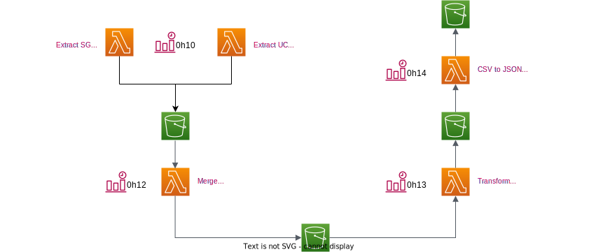

# Stability Warrants

Website : https://qlefevre.github.io/stabilitywarrants/

This project is an example of the use of lambda functions in Python.  
It is based on the [Scaleway](https://www.scaleway.com/en/serverless-functions/) provider and
the [serverless framework](https://www.serverless.com/).

# Serverless diagram

Project is based on 5 functions :
1. Download stability warrants from Société Générale and Unicredit
2. Merges SG and UC csv files into one ALL
3. Transforms and applies the algorithm
4. Transforms the csv file to json

# AMF warning and financial products

This personal project is not affiliated in any way with Unicredit or Société Générale.  
I am just a developer and not an investment advisor, please get trained in derivatives.

Stability Warrants : leverage products with a risk of loss of capital during the life and at maturity. these products
are intended for sophisticated investors with sufficient experience to understand their characteristics and to assess
their risks, and who are able to follow their evolution in real time.
